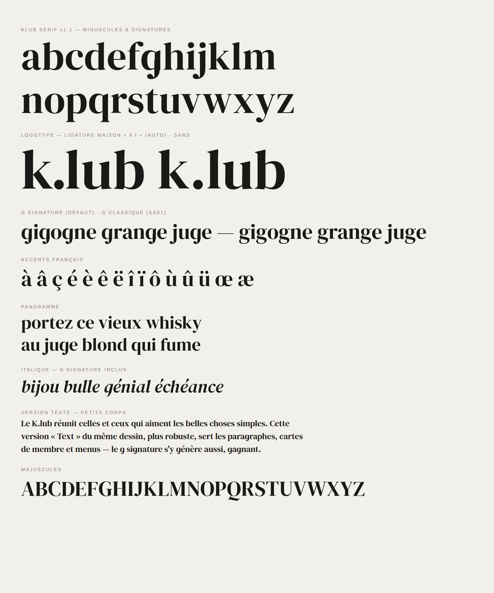

# Klub Serif

Famille typographique du **K.lub** — quatre styles de qualité fonderie,
fidèles au logotype. Version actuelle : **v1.2** (K du logotype tracé, g signature, ligature « k.l »).



## ⚡ Démarrage rapide

### Sur un site web — 1 ligne, zéro fichier (CDN)

```html
<link rel="stylesheet"
  href="https://cdn.jsdelivr.net/gh/fabultra/klub-serif@main/fonts/web/klub-serif.css">
```

Puis dans le CSS du site :

```css
h1, h2, .logo { font-family: "Klub Serif Display", Georgia, serif; }
body          { font-family: "Klub Serif Text", Georgia, serif; }
```

C'est tout. La ligature « k.lub » se fait automatiquement.

### Sur un site web — auto-hébergé (recommandé en production)

Depuis la racine de votre projet web :

```bash
curl -fsSL https://raw.githubusercontent.com/fabultra/klub-serif/main/install.sh | bash
```

(ou `./install.sh mon/dossier` depuis un clone du repo). Le script copie
les fontes + la feuille `klub-serif.css` dans `./fonts` et affiche les
deux lignes à coller dans le `<head>` :

```html
<link rel="stylesheet" href="/fonts/klub-serif.css">
<link rel="preload" href="/fonts/KlubSerifDisplay-Regular.woff2" as="font" type="font/woff2" crossorigin>
```

### Sur un builder (WordPress, Webflow, Squarespace, Shopify…)

Chercher la fonction « custom fonts / polices personnalisées » de l'outil,
téléverser les 4 fichiers de [`fonts/web/`](fonts/web/) (woff2) et nommer
les familles exactement `Klub Serif Display` et `Klub Serif Text`.

### Sur un ordinateur (print, bureautique, maquettes)

Télécharger les `.ttf` de [`fonts/ttf/`](fonts/ttf/) → double-clic →
« Installer ». Les fontes apparaissent dans Figma, Canva, Word, etc.

## Styles

| Famille | Style | Usage |
| --- | --- | --- |
| Klub Serif Display | Regular / Italic | Titres, logotype, affichage |
| Klub Serif Text | Regular / Italic | Paragraphes, menus, petits corps |

Couverture : latin étendu, accents français complets (à â ç é è ê ë î ï ô ù û ü œ æ),
chiffres, ponctuation. Espacement et crénage d'origine professionnelle.

## Signatures K.lub (OpenType)

- **Le K du logotype (v1.2)** — le glyphe K de la Display Regular est le
  **tracé vectorisé du K original du logo** (source :
  [`assets-source/K.png`](assets-source/K.png), dessin propriété du
  K.lub) : jambe en swash plongeant 75 unités sous la ligne de base,
  chasse 782. Le K est la seule lettre à porter cette jambe — c'est
  l'ADN de la marque. Les coupes Text et l'italique gardent le K
  classique pour les petits corps.
- **g à un étage par défaut** — dessiné par greffe de pièces du dessin
  d'origine (panse du `q`, crochet du `j`), dans les quatre styles.
  Le g classique à deux étages reste accessible :
  `font-feature-settings: "ss01" 1;`
- **Ligature maison « k.l »** — la séquence `k.l` (comme dans « k.lub »)
  se compose automatiquement en un glyphe unique au chassé resserré.
  Désactivable au besoin : `font-feature-settings: "liga" 0;`

Démo en ligne : la page [`docs/index.html`](docs/index.html) (activable en
site via Settings → Pages → `main` → `/docs`).

## Structure du repo

```
fonts/ttf/   TTF a installer (ordinateur)
fonts/web/   WOFF2 + klub-serif.css (site web)
docs/        Page specimen + planche PNG
LICENSES/    Licences SIL OFL 1.1 (a conserver)
tools/       Scripts de regeneration (fontTools)
install.sh   Installateur web (copie fonts/web dans un projet)
```

## Provenance et licence

Klub Serif est une **adaptation renommée** de *DM Serif Display* et
*DM Serif Text* (Colophon Foundry pour Google), elles-mêmes dérivées de
*Source Serif* (Adobe). Modifications : renommage conforme, g à un étage
par défaut (original en `ss01`), ligature `k.l`.

Licence **SIL Open Font License 1.1** — voir [`LICENSES/`](LICENSES/) :

- usage commercial, modification et redistribution autorisés ;
- conserver les fichiers de licence en cas de redistribution des fontes ;
- ne pas vendre les fichiers de fonte seuls ;
- le nom réservé « Source » n'est pas utilisé.

## Outils

- [`tools/rebrand.py`](tools/rebrand.py) — régénère la famille depuis les
  DM Serif d'origine (renommage OFL, TTF + WOFF2).
- [`tools/variantes.py`](tools/variantes.py) — applique les signatures
  v1.1 (g à un étage, ligature `k.l`, feature `ss01`).
- Prérequis : `pip install fonttools brotli skia-pathops`.

## Feuille de route

- [x] Famille 4 styles (Display/Text × romain/italique) — v1.0
- [x] Signatures : g à un étage (défaut, classique en ss01) et
      ligature « k.l » — v1.1
- [x] K du logotype tracé (Display Regular) — v1.2
- [x] Feuille `klub-serif.css` + `install.sh`
- [ ] Graisse supplémentaire si le besoin apparaît (non recommandé en
      synthétique ; à dessiner ou à emprunter à l'ascendance Source Serif)
